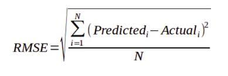

## Author - Jashandeep Singh (101916123) 4CS12
## Prediction in time series dataset
 
-We are predicting the parameters Para-9, Para-10, Para-11, Para-12, and Para-13 for year 10 from a 10-year dataset from an IoT sensor on the road. (Predict values of 5 parameters based on multi-input time series data.)

## Requirements

- Predict values for Para-9 to Para-13 for tenth year of each road section.
- Create graphs for comparing actual values with predicted values for Para-9 to Para-13.

## Model Used

- XGBoost Regressor

## Metric Used

- RMSE: Root Mean Square Error

  

## Result

Final RMSE = 26.50
